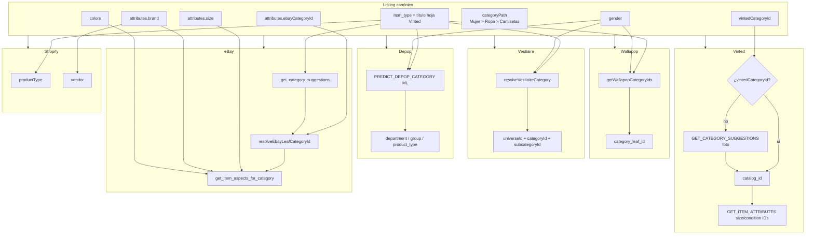

# Matching de categorías: listing → marketplaces

No hay una tabla única de equivalencias entre plataformas. El listing guarda un modelo **centrado en Vinted** (`categoryPath`, `vintedCategoryId`) más pistas genéricas (`item_type`, `gender`). Cada marketplace traduce esas pistas **en el momento de publicar**.

## Diagrama

## Flow Summary

1. El usuario / la IA elige una categoría del árbol Vinted (`data/categories.json`).
2. Se persisten `categoryPath`, `vintedCategoryId`, `item_type` (título de la hoja) y `gender`.
3. Al publicar, cada conector ignora o reusa esos campos de forma distinta:
   - **Vinted**: usa `vintedCategoryId` directo; si falta, sugiere por foto.
   - **Wallapop / Vestiaire**: heurística por `item_type` + `gender` + título.
   - **Depop**: predicción ML + filtro por género.
   - **eBay**: `ebayCategoryId` si existe; si no, Taxonomy API (`get_category_suggestions` + leaf verification).
   - **Shopify**: no hay taxonomía; `item_type` se copia a `productType`.
4. Talla, color, marca y condición se mapean **después** de conocer la categoría destino, contra las opciones que esa plataforma expone.

## Campos del listing usados como puente

| Campo | Origen | Quién lo usa |
|-------|--------|--------------|
| `attributes.categoryPath` | Picker Vinted / IA | UX; no se envía a otras APIs |
| `attributes.vintedCategoryId` | Picker Vinted / IA | Solo Vinted (`catalog_id`) |
| `attributes.ebayCategoryId` | Import eBay | Solo eBay |
| `item_type` / `itemType` | Título de la hoja Vinted | Wallapop, Vestiaire, Depop, eBay suggestions, Shopify `productType` |
| `gender` | Formulario | Wallapop, Vestiaire, Depop, eBay aspect Department |
| `attributes.size` | Formulario (`XS`…`Talla única`) | Todas las plataformas de moda |
| `attributes.brand` | Formulario | Todas |
| `colors[]` | Formulario (nombres ES) | Todas |
| `condition` | Formulario | Todas |
| `title` | Formulario / IA | Heurísticas y eBay `get_category_suggestions` |

## Resolución por marketplace

### Vinted

1. Si `attributes.vintedCategoryId` existe y no es `0` → `catalog_id`.
2. Si no, `GET_CATEGORY_SUGGESTIONS` con la foto.
3. Fallback hardcoded `categoryId = 123` (riesgo: categoría inválida).
4. `GET_ITEM_ATTRIBUTES` con esa categoría → IDs de talla y condición.

### Wallapop

1. Descarga el árbol (`GET_WALLA_CATEGORIES`).
2. `itemTypeMap` convierte palabras de `item_type`/`title` (`camiseta` → `camisetas`).
3. DFS bajo Moda (`12465`), podando género opuesto y rama deporte.
4. Si no hay match: leaf por género (`hombre` → `11043`, `mujer` → `11020`).

### Vestiaire Collective

1. Universo por `gender` (`mujer=1`, `hombre=2`, default `2`).
2. Si el título/tipo parece bolso → categoría Bolso.
3. Si no, match de subcategoría contra `item_type`/`title`.
4. Fallback: primera categoría “Ropa” o IDs `12` / `525`.
5. Campos dinámicos (talla, color, condición) se rellenan contra `formOptions`.

### Depop

1. `PREDICT_DEPOP_CATEGORY` (ML) con descripción + género.
2. Se elige la predicción cuyo `gender` coincida (`male`/`female`).
3. Fallback: `menswear / tops / other-tops`.
4. Talla: mapping categoría → `size_set_by_region` + filtros.

### eBay

1. Candidatos: `EBAY_DEFAULT_CATEGORY_ID`, `attributes.ebayCategoryId`, `itemType` numérico, leafs conocidos (`260023` en ES).
2. Cada candidato se verifica con `get_item_aspects_for_category` (solo hojas).
3. En producción: `get_category_suggestions(title + itemType)` y primer leaf bajo el padre de moda (`260019` en ES).
4. Aspectos (Talla, Marca, Color…) se rellenan contra los valores estándar de esa hoja.

### Shopify

Sin taxonomía. `productType = itemType`, `vendor = brand`, tags = condición/género/colores.

## Source Files

- `data/categories.json` — árbol Vinted (UX / IA)
- `lib/categories.ts` — flatten y fuzzy match
- `app/inventory/listings/new_listing/components/CategorySelect.tsx`
- `app/api/field-suggestions/route.ts`
- `models/Listing.ts`
- `lib/workflows/step-executor.ts` — matching Vinted/Wallapop/Vestiaire/Depop
- `lib/workflows/vestiaire/vestiaire-field-mapper.ts`
- `libs/ebay/mappers.ts` — leaf category + aspectos
- `libs/ebay/inventory.ts` — publicación
- `app/api/shopify/upload-product/route.ts`
- `lib/external-integrations/validators.ts` — campos requeridos pre-publish

## Important Decisions

- **No hay tabla cruzada** `vintedCategoryId ↔ wallapopLeaf ↔ ebayCategoryId`. El puente semántico es `item_type` (texto).
- Fallbacks numéricos (`123` Vinted, `'32'` Wallapop size, `'1'` Depop size) son truthy y **pueden publicar con valor incorrecto** en lugar de fallar.
- eBay es el único marketplace que consulta taxonomía en vivo para leaf + item specifics.
- eBay **no** usa `vintedCategoryId` ni `categoryPath`.
- Validación previa (`validators.ts`) exige `item_type` y `size` en Vinted/Wallapop/Vestiaire/Depop, **no en eBay** (solo título, descripción, precio, foto).

## External Dependencies

- Vinted catalog / photo category suggestions (vía extensión)
- Wallapop category tree + upload components
- Vestiaire catalog + formOptions
- Depop ML category prediction + size mapping
- eBay Taxonomy API (`get_default_category_tree_id`, `get_category_suggestions`, `get_category_subtree`, `get_item_aspects_for_category`)
- eBay Metadata API (`get_item_condition_policies`)
- Shopify Admin API (sin taxonomía de moda)
