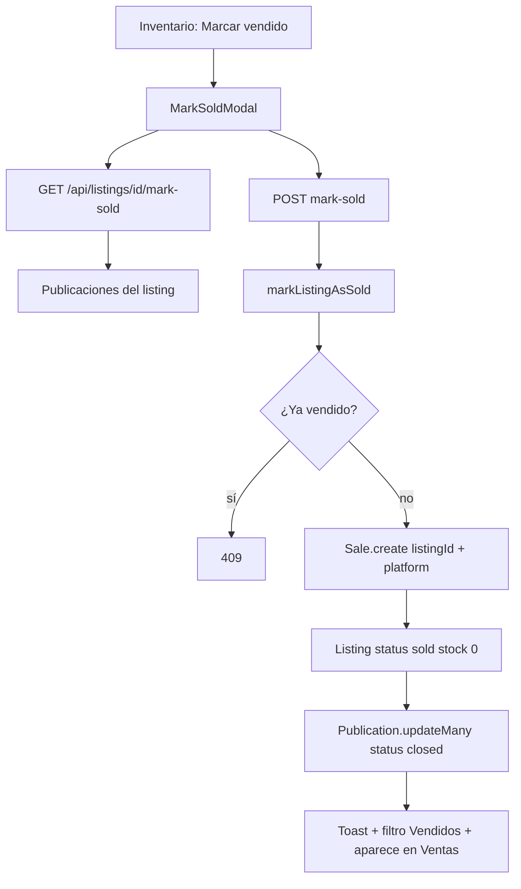
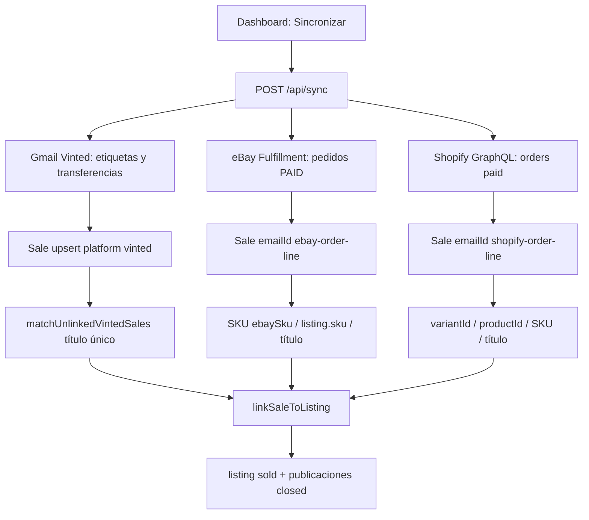

# Ventas enlazadas al inventario

Tres caminos llegan al mismo resultado: una `Sale` con `listingId`, el listing en `sold` y las publicaciones cerradas en Relist.

## 1. Manual desde inventario

## 2. Sync automático (Dashboard → Sincronizar)

## Flow Summary

### Manual
1. El modal carga publicaciones del listing.
2. POST crea una venta `isManual` con `listingId` y `platform`.
3. Listing a `sold`, stock 0, publicaciones `closed` en Relist (no se retiran en las tiendas).

### Gmail / Vinted
1. El sync guarda ventas de correos con `platform: "vinted"`.
2. Las que no tienen `listingId` se casan si hay **un solo** listing no vendido con el mismo título (o uno contenido en el otro, ≥12 caracteres).
3. Nombres genéricos (`Artículo desconocido`, `Devolución parcial`) no se casan.
4. Si hay dos listings con el mismo título, se omite: usa Marcar vendido a mano.

### eBay
1. Por cada cuenta eBay se listan pedidos `orderpaymentstatus:{PAID}` (Fulfillment API).
2. Cada línea genera `emailId = ebay-{orderId}-{lineItemId}`.
3. Match por `publication.ebaySku` o `listing.sku`, luego título único.

### Shopify
1. Pedidos pagados vía GraphQL (`read_orders`).
2. `emailId = shopify-{orderGid}-{lineItemGid}`.
3. Match por `shopifyVariantId`, `externalId` del producto, SKU o título único.
4. Si Shopify responde ACCESS_DENIED, hay que **reconectar** la tienda en Ajustes (el scope nuevo es `read_orders`). Pedidos de más de 60 días pueden requerir `read_all_orders` en la app de Shopify.

## Source Files

- `libs/sales/mark-sold.ts` — alta manual y `linkSaleToListing`
- `libs/sales/match-listing.ts` — título / SKU / IDs de plataforma
- `libs/sales/sync-marketplace-orders.ts` — orquesta eBay + Shopify
- `libs/ebay/orders.ts`
- `libs/shopify/orders.ts`
- `app/api/listings/[id]/mark-sold/route.ts`
- `app/api/sync/route.ts`
- `app/api/sales/sync/route.ts`
- `app/api/shopify/install/route.ts` — scope `read_orders`
- `models/Sale.ts`
- `app/inventory/listings/components/MarkSoldModal.tsx`

## Important Decisions

- Un listing solo puede tener una venta (`índice unique sparse` en `listingId`).
- El match por título solo aplica si el candidato es **único**; no se adivina.
- Gmail no pisa `listingId` ya enlazado: el `$set` no incluye ese campo.
- No se despublica en marketplaces (igual que al borrar un listing).
- Shopify conectado antes de este cambio no tiene `read_orders` hasta reconectar.
- El filtro de inventario por defecto oculta vendidos (`Disponibles`).

## External Dependencies

- MongoDB (`listings`, `publications`, `sales`, `accounts`)
- Gmail API (ventas Vinted)
- eBay Sell Fulfillment API (`sell.fulfillment`)
- Shopify Admin GraphQL (`read_orders`)
