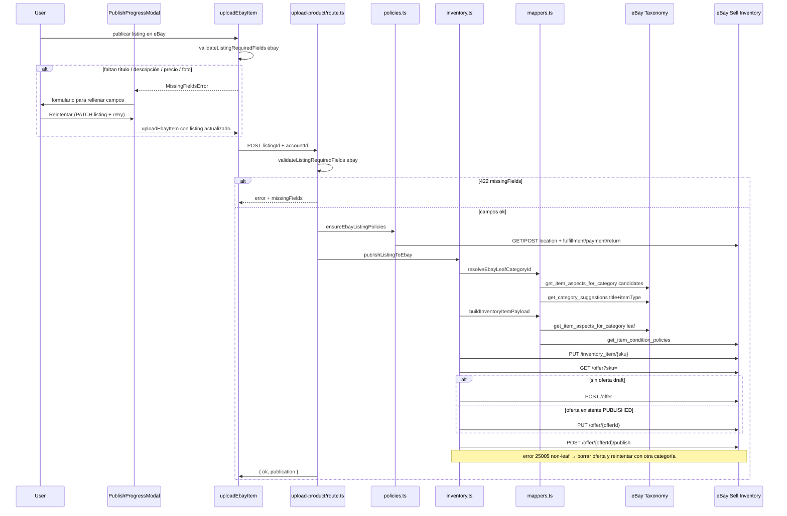

# Publicación en eBay (Inventory API)

Flujo real de `POST /api/ebay/upload-product`: validación de campos → políticas de vendedor → inventory item → offer → publish. Si faltan campos (p. ej. descripción), la cola muestra un formulario para rellenarlos y reintentar.

## Diagrama

## Flow Summary

1. En cliente, `uploadEbayItem` exige título, descripción, precio > 0 y al menos una foto. Si faltan, lanza `MissingFieldsError` y el modal deja rellenar el campo y reintentar (guarda el listing y vuelve a publicar).
2. La ruta vuelve a validar los mismos campos (`HTTP 422` + `missingFields` si faltan).
3. `ensureEbayListingPolicies` garantiza `merchantLocationKey` + tres Business Policies del marketplace (`EBAY_ES` en producción).
4. Se resuelve un `categoryId` **hoja** (error 25005 si se usa un padre como 11450).
5. Se construye el inventory item con `product.aspects` tomados de `get_item_aspects_for_category` (Talla, Marca, Color…).
6. Se crea o actualiza la offer FIXED_PRICE y se publica. El publish **no lleva body**.

## Source Files

- `lib/external-integrations/validators.ts`
- `lib/external-integrations/ebay-functions.ts`
- `lib/queue/executors.ts`
- `app/inventory/listings/components/PublishProgressModal.tsx`
- `app/api/ebay/upload-product/route.ts`
- `libs/ebay/inventory.ts`
- `libs/ebay/mappers.ts`
- `libs/ebay/policies.ts`
- `libs/ebay/api.ts`
- `libs/ebay/client.ts`

El inventario de campos (valores, origen, errores) está en [ebay-api-fields.md](../data/ebay-api-fields.md).

## Important Decisions

- eBay entra en el mismo validador de campos obligatorios que Vinted/Wallapop/Depop/Vestiaire. Campos eBay: `title`, `description`, `price`, `photo_url`.
- El 422 de la API incluye `missingFields` (`{ key, label }`) para que la cola pueda mostrar el formulario aunque la validación ocurra en servidor.
- Marketplace de producción: `EBAY_MARKETPLACE_ID` o default `EBAY_ES`. Sandbox fuerza `EBAY_US` + `en-US`.
- Ofertas draft antiguas se **borran y recrean** para no heredar un `categoryId` no-hoja.
- Políticas cacheadas inválidas (25709 / 25007) se recrean y se reintenta una vez.
- Aspectos: si eBay lista valores estándar, **nunca** se envía un valor custom (error 25129 “Talla ya no admite valores personalizados”).
- Alias ES→canónico: `Talla` → `size`, `Marca` → `brand`. Antes, Talla caía en el fallback de color y se enviaba `"Black"`.

## External Dependencies

- eBay OAuth (`sell.inventory`, `sell.account`, `sell.fulfillment`)
- Sell Inventory API: `inventory_item`, `offer`, `location`
- Sell Account API: fulfillment / payment / return policies
- Commerce Taxonomy API
- Sell Metadata API: condition policies + shipping services
